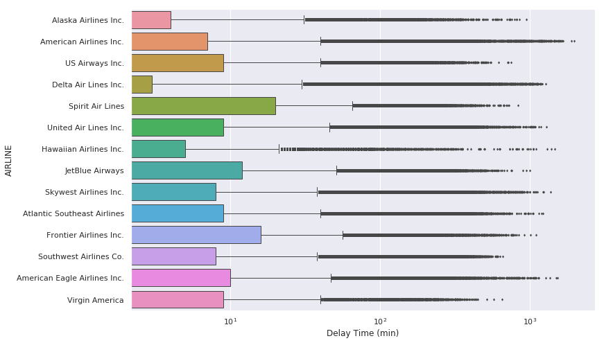
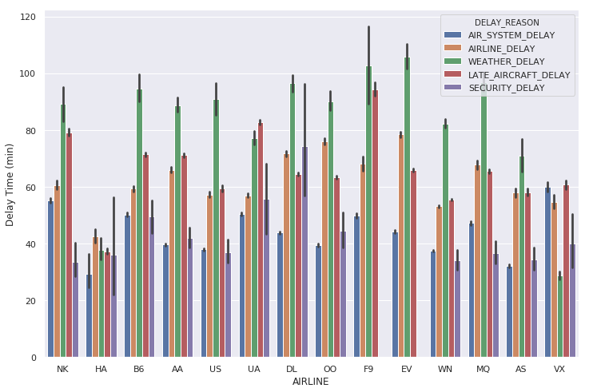

# Note
I have published this notebook in Kaggle. Please view the detail codes from <a href="https://www.kaggle.com/together/visualization-flight-delays?scriptVersionId=29191037">Visualization-Flight-Delay[Kaggle]</a>.

# Flight Delay Analysis
The topic comes from a Kaggle Dataset named <a href="https://www.kaggle.com/usdot/flight-delays#flights.csv">2015 Flight Delays and Cancellations</a>.
 
The dataset comes from Department of Transportation (US). 

## Objective
In this project, I used several packages (including <a href="https://plot.ly">plot.ly</a>) in Python to visualize this big dataset. 

## Visualization Preview
<h4>Pie Chart</h4>
</img>
<h4>Bar Chart</h4>
</img>
<h4>Column Chart</h4>
</img>
<h4>Choropleth Maps</h4>
</img>
<h4>Linked Maps</h4>
</img>
